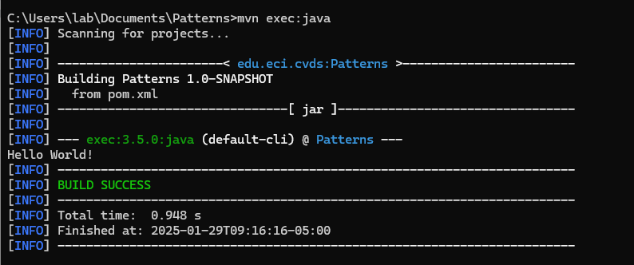
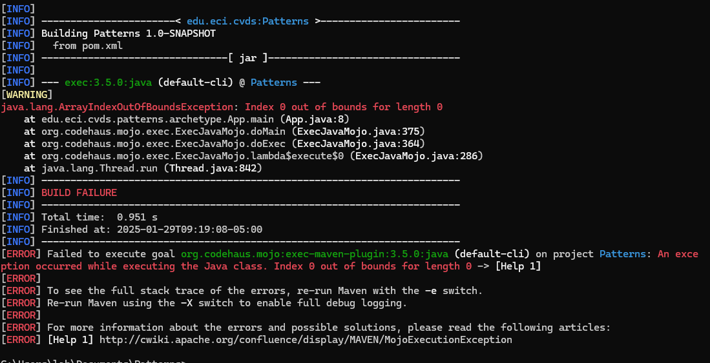
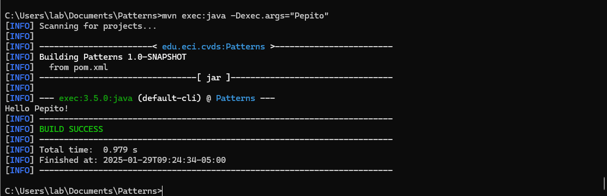
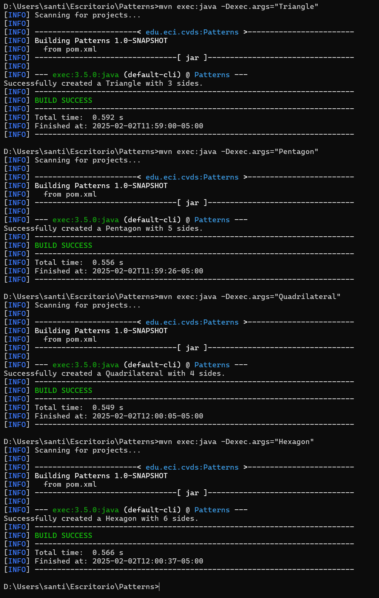

# Patterns
## Respuestas
1. El comando mvn package de Maven se utiliza para compilar el código, ejecutar las pruebas y empaquetar
el código compilado y otros recursos en un formato distribuible, como un archivo JAR, WAR o EAR. Este
comando es una parte clave del ciclo de vida de compilación de Maven, que normalmente se usa para crear
un artefacto que se puede implementar o distribuir.
2. Para ejecutar la aplicación principal del programa, es necesario configurar la dirección del archivo
.java en el archivo pom.xml, indicando el paquete que debe ejecutarse. De esta manera, será suficiente con
escribir el comando mvn exec:java desde la consola. De lo contrario, será necesario especificar la dirección
completa con el comando mvn exec:java -Dexec.mainClass="edu.eci.cvds.patterns.archetype.App""
.png)

3. Si se intenta ejecutar el programa que requiere recibir un parámetro, se producirá un error al intentar
ejecutarlo desde la consola.

Para enviar parámetros, se debe ejecutar el comando mvn exec:java -Dexec.args="Argumentos a agregar".
En el siguiente ejemplo, se agregó 'Pepito' como argumento.

4. La fábrica utilizada fue el Method Factory, ya que, en caso de necesitar agregar nuevas figuras en el futuro,
el programador únicamente tendrá que añadir el tipo de figura en RegularShapeType y la figura correspondiente en
ShapeFactory. Las figuras que retorna dependen de la interfaz Shape.

## Integrantes
- Santiago Botero Garcia - [LePeanutButter](https://github.com/LePeanutButter)
- Ricardo Andres Ayala Garzon - [lRicardol](https://github.com/lRicardol)